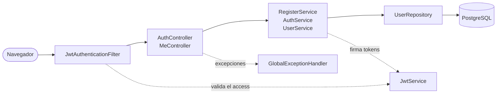
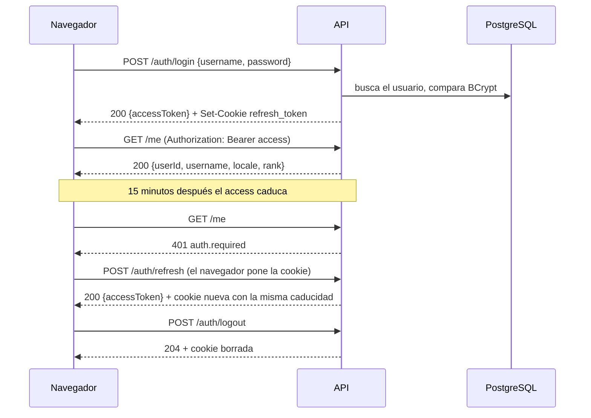
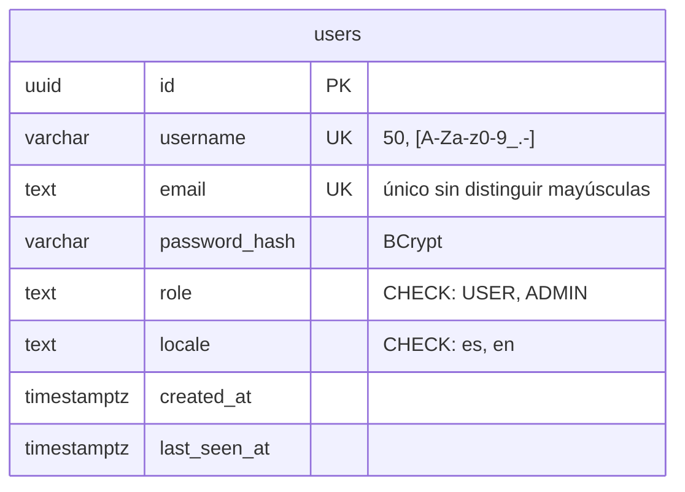

# IulianLounge: backend

🌐 [English](README.md) | Español


Un speakeasy de los años 20 que se recorre en 3D. Este repositorio es la API:
cuentas, sesiones y, en las próximas semanas, la cartera de fichas y el barman.
El cliente (Vue 3 + Three.js) vive en
[iulianlounge-frontend](https://github.com/iulian640/iulianlounge-frontend).

**Estado (25-sep-2026):** la autenticación está terminada: registro, login,
refresh con cookie `HttpOnly`, logout y `GET /me`. Lo siguiente es la cartera
con su ledger (sprint 9). La entrega es el 13 de octubre.

## Stack

Java 21 y Spring Boot 4.1. Spring Security con un filtro JWT propio (jjwt),
Spring Data JPA sobre PostgreSQL 17 en Docker y migraciones con Flyway. Los
tests usan JUnit 5, Mockito y MockMvc, y el CI falla si la cobertura de líneas
baja del 80 % (JaCoCo).

## Arranque

Necesitas JDK 21 y Docker.

```fish
# Una sola vez. Esto es fish; en bash: export DB_PASSWORD=... en tu ~/.bashrc
set -Ux DB_PASSWORD elige_una_password
set -Ux JWT_SECRET (openssl rand -base64 32)

docker compose up -d        # PostgreSQL en localhost:5432
./mvnw spring-boot:run      # API en localhost:8080
```

`curl localhost:8080/actuator/health` debe devolver `{"status":"UP"}`.

`JWT_SECRET` tiene que ser base64 de 32 bytes o más. Con otra cosa la app no
arranca, a propósito.

Para los tests: `./mvnw verify`. Los de repositorio van contra el Postgres de
la compose, así que tiene que estar levantado.

## API

Base: `/api/v1`. Las respuestas son JSON plano, sin envoltorio.

| Método | Ruta | Qué hace |
|---|---|---|
| POST | `/auth/register` | `{username, email, password, locale}` → 201 `{userId}` |
| POST | `/auth/login` | `{username, password}` → `{accessToken, expiresIn}` y la cookie `refresh_token` |
| POST | `/auth/refresh` | Sin cuerpo: lee la cookie → `{accessToken, expiresIn}` y una cookie nueva |
| POST | `/auth/logout` | Borra la cookie → 204 |
| GET | `/me` | Con `Authorization: Bearer` → `{userId, username, locale, rank}` |

El access token dura 15 minutos y el frontend lo guarda en memoria. El refresh
dura como mucho 7 días desde el login y viaja en una cookie que el JavaScript no
puede leer (`HttpOnly; Secure; SameSite=Strict`). Por qué así: [ADR-08](docs/adr/ADR-08-jwt-stateless-con-refresh-token.md).

Los errores siguen el RFC 7807. El frontend lee `code` y lo traduce; `detail`
va en inglés y es solo para depurar ([ADR-06](docs/adr/ADR-06-i18n-claves-backend-textos-frontend.md)):

```json
{
  "status": 400,
  "code": "validation.failed",
  "detail": "Request validation failed",
  "errors": { "email": "validation.email", "password": "validation.size" }
}
```

La lista completa de códigos está en
[`ErrorCode`](src/main/java/com/iulianlounge/backend/exception/ErrorCode.java).

## Cómo está hecho

### Capas

Cada petición pasa por el filtro JWT y baja por capas: el controller habla
HTTP, el service tiene las reglas y el repository habla con la base de datos.
Ningún controller toca un repository.



### Una sesión, de principio a fin



### Modelo de datos

Hoy solo existe `users` (migraciones V1 a V3). La cartera y el ledger llegan en
la V4.



## Documentación

Todo está en español (original) e inglés (`*.en.md`).

| Documento | ES | EN |
|---|---|---|
| Concepto de producto | [CONCEPT.md](CONCEPT.md) | [CONCEPT.en.md](CONCEPT.en.md) |
| Arquitectura técnica | [docs/architecture.md](docs/architecture.md) | [docs/architecture.en.md](docs/architecture.en.md) |
| La ficción del club | [docs/ficcion.md](docs/ficcion.md) | [docs/ficcion.en.md](docs/ficcion.en.md) |
| Enunciado del bootcamp | [docs/enunciado.md](docs/enunciado.md) | [docs/enunciado.en.md](docs/enunciado.en.md) |
| Diario de desarrollo | [docs/devlog.md](docs/devlog.md) | |

### ADRs (Architecture Decision Records)

Los ADR 01-03 y 07 viven resumidos en [architecture.md §4](docs/architecture.md)
y se expanden cuando se implementan.

| ADR | ES | EN |
|---|---|---|
| 04: ledger append-only + saldo materializado | [ES](docs/adr/ADR-04-ledger-append-only-saldo-materializado.md) | [EN](docs/adr/ADR-04-ledger-append-only-saldo-materializado.en.md) |
| 05: barman LLM, function calling en lista blanca | [ES](docs/adr/ADR-05-barman-llm-function-calling-lista-blanca.md) | [EN](docs/adr/ADR-05-barman-llm-function-calling-lista-blanca.en.md) |
| 06: i18n, claves en backend y textos en frontend | [ES](docs/adr/ADR-06-i18n-claves-backend-textos-frontend.md) | [EN](docs/adr/ADR-06-i18n-claves-backend-textos-frontend.en.md) |
| 08: JWT stateless con refresh token | [ES](docs/adr/ADR-08-jwt-stateless-con-refresh-token.md) | [EN](docs/adr/ADR-08-jwt-stateless-con-refresh-token.en.md) |
| 09: fichas como enteros, prohibido double | [ES](docs/adr/ADR-09-fichas-enteros-long-prohibido-double.md) | [EN](docs/adr/ADR-09-fichas-enteros-long-prohibido-double.en.md) |

## Gestión

Jira, proyecto IUL. Sprints de una semana del 8 al 11, con la entrega el
13-oct-2026.
