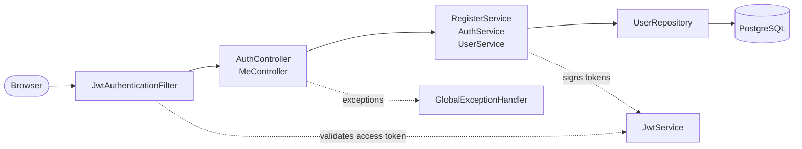
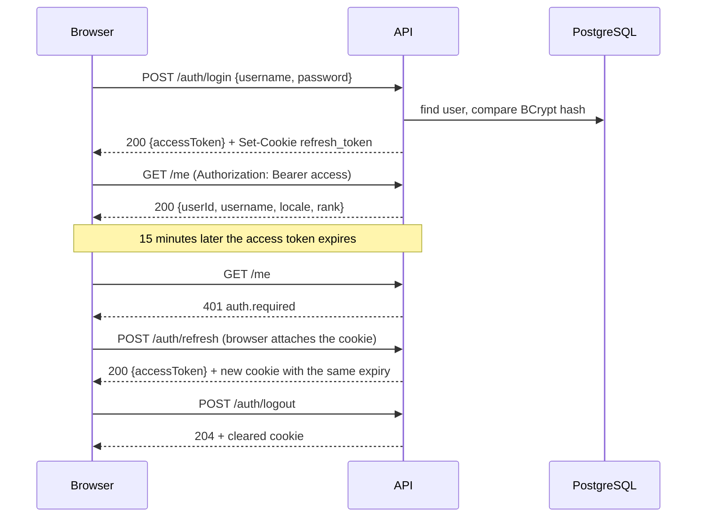
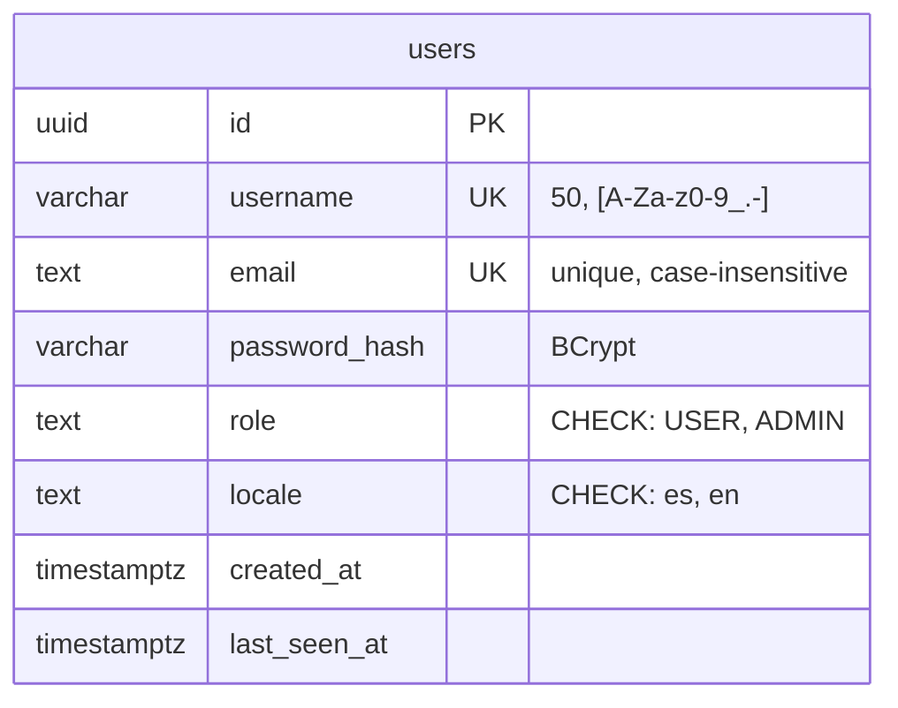

# IulianLounge: backend

🌐 English | [Español](README.es.md)


A 1920s speakeasy you walk through in 3D. This repository is the API: accounts,
sessions and, over the next few weeks, the chip wallet and the bartender. The
client (Vue 3 + Three.js) lives in
[iulianlounge-frontend](https://github.com/iulian640/iulianlounge-frontend).

**Status (2026-09-25):** authentication is done: register, login, refresh with
an `HttpOnly` cookie, logout and `GET /me`. Next up is the wallet and its ledger
(sprint 9). Delivery is on October 13.

## Stack

Java 21 and Spring Boot 4.1. Spring Security with a hand-written JWT filter
(jjwt), Spring Data JPA on PostgreSQL 17 in Docker, and Flyway migrations. Tests
use JUnit 5, Mockito and MockMvc, and CI fails if line coverage drops below 80 %
(JaCoCo).

## Getting started

You need JDK 21 and Docker.

```fish
# Once. This is fish; in bash: export DB_PASSWORD=... in your ~/.bashrc
set -Ux DB_PASSWORD pick_a_password
set -Ux JWT_SECRET (openssl rand -base64 32)

docker compose up -d        # PostgreSQL on localhost:5432
./mvnw spring-boot:run      # API on localhost:8080
```

`curl localhost:8080/actuator/health` should return `{"status":"UP"}`.

`JWT_SECRET` must be base64 and decode to 32 bytes or more. Anything else stops
the app from starting, on purpose.

To run the tests: `./mvnw verify`. The repository tests hit the compose
Postgres, so it has to be up.

## API

Base path: `/api/v1`. Responses are plain JSON, no envelope.

| Method | Path | What it does |
|---|---|---|
| POST | `/auth/register` | `{username, email, password, locale}` → 201 `{userId}` |
| POST | `/auth/login` | `{username, password}` → `{accessToken, expiresIn}` plus the `refresh_token` cookie |
| POST | `/auth/refresh` | No body: reads the cookie → `{accessToken, expiresIn}` and a new cookie |
| POST | `/auth/logout` | Clears the cookie → 204 |
| GET | `/me` | With `Authorization: Bearer` → `{userId, username, locale, rank}` |

The access token lasts 15 minutes and the frontend keeps it in memory. The
refresh token lasts at most 7 days from login and travels in a cookie that
JavaScript can't read (`HttpOnly; Secure; SameSite=Strict`). The reasoning is in
[ADR-08](docs/adr/ADR-08-jwt-stateless-con-refresh-token.en.md).

Errors follow RFC 7807. The frontend reads `code` and translates it; `detail` is
English and only for debugging ([ADR-06](docs/adr/ADR-06-i18n-claves-backend-textos-frontend.en.md)):

```json
{
  "status": 400,
  "code": "validation.failed",
  "detail": "Request validation failed",
  "errors": { "email": "validation.email", "password": "validation.size" }
}
```

The full list of codes is in
[`ErrorCode`](src/main/java/com/iulianlounge/backend/exception/ErrorCode.java).

## How it's built

### Layers

Every request goes through the JWT filter and then down the layers: the
controller speaks HTTP, the service holds the rules and the repository talks to
the database. No controller touches a repository.



### A session, start to finish



### Data model

Only `users` exists today (migrations V1 to V3). The wallet and ledger arrive
in V4.



## Documentation

Everything exists in Spanish (original) and English (`*.en.md`).

| Document | ES | EN |
|---|---|---|
| Product concept | [CONCEPT.md](CONCEPT.md) | [CONCEPT.en.md](CONCEPT.en.md) |
| Technical architecture | [docs/architecture.md](docs/architecture.md) | [docs/architecture.en.md](docs/architecture.en.md) |
| The club's fiction | [docs/ficcion.md](docs/ficcion.md) | [docs/ficcion.en.md](docs/ficcion.en.md) |
| Bootcamp brief | [docs/enunciado.md](docs/enunciado.md) | [docs/enunciado.en.md](docs/enunciado.en.md) |
| Dev log | [docs/devlog.md](docs/devlog.md) | |

### ADRs (Architecture Decision Records)

ADRs 01-03 and 07 are summarised in [architecture.en.md §4](docs/architecture.en.md)
and get their own file when they're implemented.

| ADR | ES | EN |
|---|---|---|
| 04: append-only ledger + materialised balance | [ES](docs/adr/ADR-04-ledger-append-only-saldo-materializado.md) | [EN](docs/adr/ADR-04-ledger-append-only-saldo-materializado.en.md) |
| 05: LLM bartender, allow-listed function calling | [ES](docs/adr/ADR-05-barman-llm-function-calling-lista-blanca.md) | [EN](docs/adr/ADR-05-barman-llm-function-calling-lista-blanca.en.md) |
| 06: i18n, keys in the backend and texts in the frontend | [ES](docs/adr/ADR-06-i18n-claves-backend-textos-frontend.md) | [EN](docs/adr/ADR-06-i18n-claves-backend-textos-frontend.en.md) |
| 08: stateless JWT with refresh token | [ES](docs/adr/ADR-08-jwt-stateless-con-refresh-token.md) | [EN](docs/adr/ADR-08-jwt-stateless-con-refresh-token.en.md) |
| 09: chips as integers, no double | [ES](docs/adr/ADR-09-fichas-enteros-long-prohibido-double.md) | [EN](docs/adr/ADR-09-fichas-enteros-long-prohibido-double.en.md) |

## Project management

Jira, project IUL. One-week sprints 8 to 11, with delivery on 2026-10-13.
