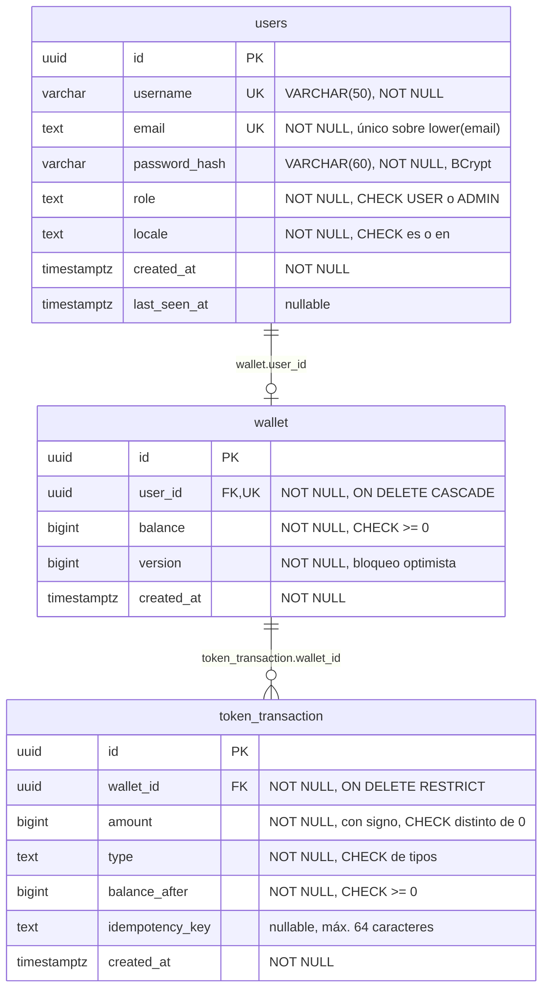
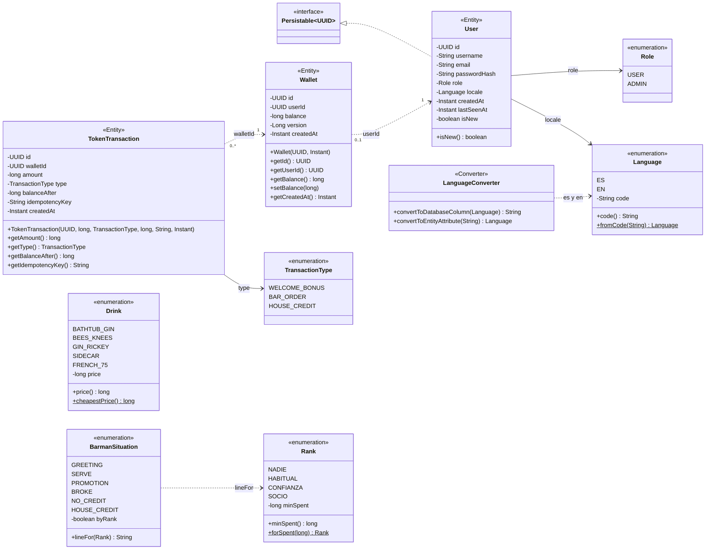
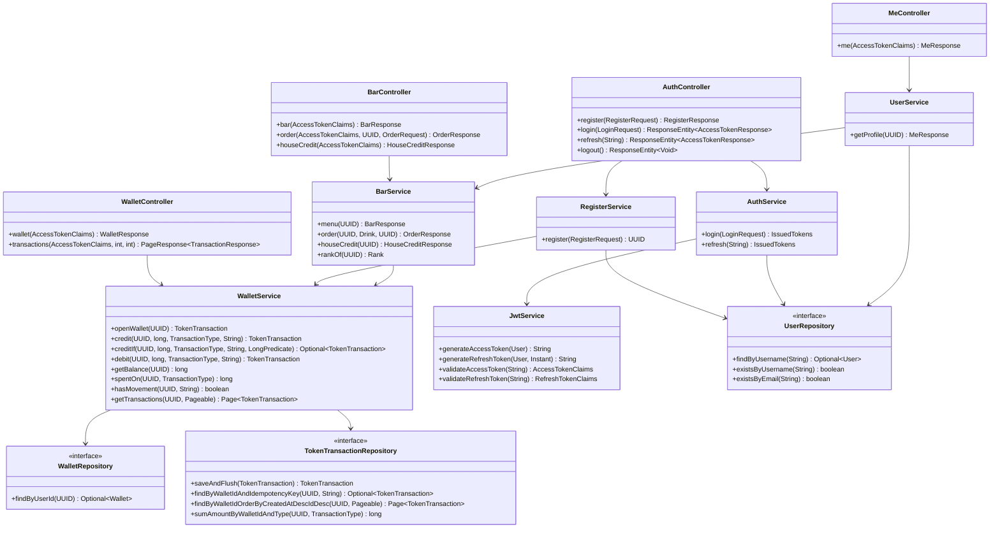
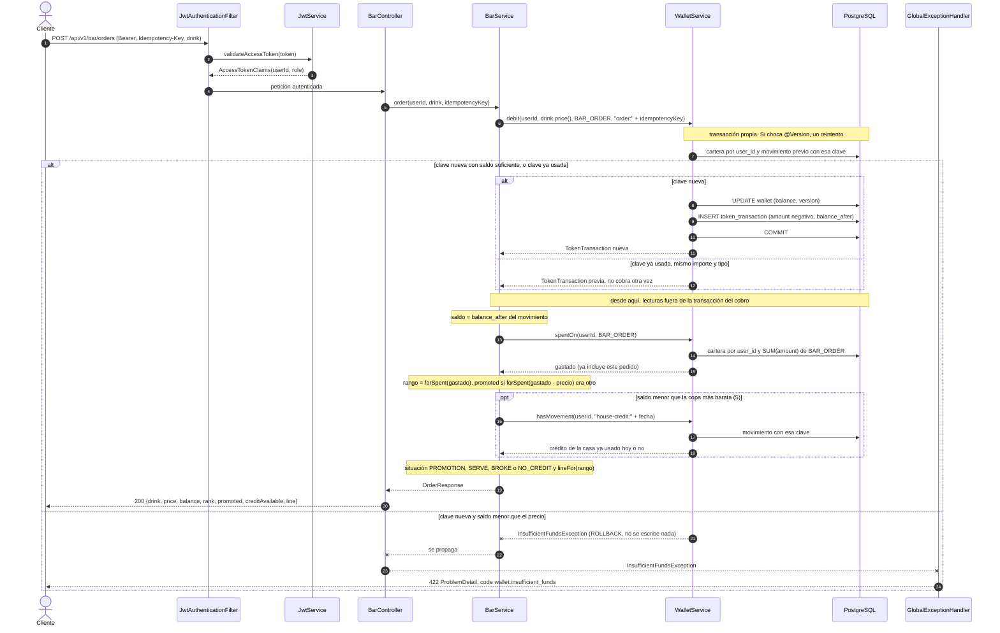

# Diagramas técnicos

Cuatro diagramas: la base de datos, las clases del dominio, las clases por capas y el flujo de pedir una copa.
Todos salen del código: migraciones Flyway V1 a V6 y paquetes de `com.iulianlounge.backend`. Si el código cambia, este fichero cambia en el mismo commit.
El diseño amplio de la Fase 0 (salas, retos, préstamos, progreso) vive en [architecture.md](architecture.md) y no está implementado.

## 1. Base de datos

Tres tablas en PostgreSQL. `flyway_schema_history` es de Flyway y no se dibuja.

Relaciones:

- `users` 1 a 1 `wallet`. `wallet.user_id` es `NOT NULL` y `UNIQUE`: cada cartera tiene un dueño y nadie tiene dos. La BD admitiría un usuario sin cartera, pero el código evita que pase: `RegisterService` abre la cartera al registrar y V4 creó una vacía a cada usuario que ya existía.
- `wallet` 1 a N `token_transaction`. El ledger solo crece (ADR-04) y `wallet.balance` es su caché.
- Las fichas son `BIGINT`, nunca decimales (ADR-09).

Restricciones e índices, con su migración:

| Tabla | Regla | Qué hace | Migración |
|---|---|---|---|
| `users` | `UNIQUE (username)` | Nombre de usuario único. Distingue mayúsculas | V1 |
| `users` | `users_email_lower_key`: índice único sobre `lower(email)` | Email único sin distinguir mayúsculas. Sustituye a `users_email_key`, que se borra | V2 |
| `users` | `users_role_check`: `role IN ('USER', 'ADMIN')` | La BD solo acepta los valores del enum `Role` | V3 |
| `users` | `users_locale_check`: `locale IN ('es', 'en')` | La BD solo acepta los códigos del enum `Language` | V3 |
| `wallet` | `UNIQUE (user_id)` | Una cartera por usuario como mucho. Es lo que hace la relación 1 a 0..1 | V4 |
| `wallet` | `user_id` `REFERENCES users (id) ON DELETE CASCADE` | Borrar el usuario borra su cartera | V4 |
| `wallet` | `CHECK (balance >= 0)` | Última defensa contra el saldo negativo, aunque Java fallara | V4 |
| `token_transaction` | `wallet_id` `REFERENCES wallet (id) ON DELETE RESTRICT` | No se puede borrar una cartera con movimientos: el ledger no se pierde. Como la cartera cae en cascada con el usuario, hoy tampoco se puede borrar un usuario con movimientos. El borrado RGPD será una operación explícita (ADR-04) | V4 |
| `token_transaction` | `CHECK (amount <> 0)` | Un movimiento de 0 no es un movimiento | V4 |
| `token_transaction` | `CHECK (balance_after >= 0)` | El saldo tras cada movimiento nunca es negativo | V4 |
| `token_transaction` | `CHECK (char_length(idempotency_key) <= 64)` | Tope a la clave que inventa el cliente | V4 |
| `token_transaction` | `token_transaction_type_check`: `type IN ('WELCOME_BONUS', 'BAR_ORDER', 'HOUSE_CREDIT')` | Tipos de movimiento. V4 solo tenía `WELCOME_BONUS`; V5 lo borra y lo crea de nuevo con los tres | V4, V5 |
| `token_transaction` | `token_transaction_amount_sign_check`: `(type = 'BAR_ORDER') = (amount < 0)` | Un pedido siempre resta. El bono y el crédito de la casa siempre suman | V6 |
| `token_transaction` | `token_transaction_wallet_idempotency_key`: índice único `(wallet_id, idempotency_key)` `WHERE idempotency_key IS NOT NULL` | Índice parcial. Un reintento con la misma clave en la misma cartera falla. Sin clave no hay límite | V4 |
| `token_transaction` | `token_transaction_wallet_created_at`: índice `(wallet_id, created_at DESC, id DESC)` | Historial paginado del más nuevo al más viejo. `id` desempata | V4 |
| `token_transaction` | `token_transaction_wallet_type`: índice `(wallet_id, type) INCLUDE (amount)` | Suma del gasto por tipo, que da el rango | V6 |

## 2. Clases del dominio

Paquete `domain`. Se omiten los getters y setters de `User`: hay uno de cada por columna. De `TokenTransaction` se omiten `getId()`, `getWalletId()` y `getCreatedAt()`.

- Las entidades no se enlazan con `@ManyToOne` ni `@OneToOne`. Cada una guarda el `UUID` de la otra (`Wallet.userId`, `TokenTransaction.walletId`), y por eso esas flechas son de puntos.
- `TokenTransaction` no tiene setters y lleva `@Immutable`: el ledger no se edita (ADR-04).
- `Wallet.version` lleva `@Version`. Si hay dos escrituras a la vez, la segunda falla en vez de machacar a la primera.
- `User` implementa `Persistable<UUID>` porque el id lo pone el servicio, no la BD. `isNew()` le dice a Spring Data si toca un `INSERT`. En `Wallet` y `TokenTransaction` el id lo genera Hibernate (`@GeneratedValue(strategy = GenerationType.UUID)`). El SQL no tiene `DEFAULT`.
- `LanguageConverter` (`@Converter(autoApply = true)`, implementa `AttributeConverter<Language, String>`) guarda `Language` como `es` o `en`. `Role` y `TransactionType` se guardan por nombre (`@Enumerated(EnumType.STRING)`).
- Valores fijos en el código: las copas de `Drink` cuestan 5, 10, 15, 25 y 40 fichas. Los rangos de `Rank` empiezan en 0, 25, 100 y 300 fichas gastadas en la barra.
- `BarmanSituation.lineFor(rank)` devuelve una clave i18n (`barman.serve.habitual`, `barman.no_credit`) y no un texto (ADR-06).

## 3. Clases por capas

### 3.1 Controladores, servicios y repositorios

Cada flecha es una dependencia que entra por el constructor. Para no ensuciar el dibujo faltan `Clock`, `PasswordEncoder`, `TransactionOperations` y el secreto JWT.

- El saldo solo se toca a través de `WalletService`. `RegisterService` (bono de bienvenida) y `BarService` (pedidos y crédito de la casa) pasan por él. Ninguno de los dos toca los repositorios de cartera. `creditIf` comprueba una condición sobre el saldo dentro de la transacción del crédito, y la vuelve a comprobar si reintenta: así el fiado no se cuela si el saldo cambió entre la consulta y el cobro. Devuelve un `Optional` vacío si la condición no se cumple, y `BarService` lo convierte en 422 con `orElseThrow`.
- `UserService` usa `BarService` solo para sacar el rango que devuelve `GET /api/v1/me`.
- `UserRepository` y `WalletRepository` extienden `JpaRepository`, y de ahí salen `findById` y `saveAndFlush`. `TokenTransactionRepository` extiende `Repository` a secas, así que no expone `delete` ni el `save` genérico.
- `AuthService` devuelve el record `IssuedTokens`. `AuthController` monta y borra la cookie `refresh_token` con los métodos estáticos de `RefreshCookies` (ADR-08).
- `JwtService` está en el paquete `security`, no en `service`.

### 3.2 Cadena de seguridad y errores

Flecha continua: dependencia de constructor o herencia. Flecha de puntos: `SecurityConfig` crea el objeto con `new`, o una clase usa a otra sin guardarla.

```mermaid
classDiagram
    direction LR

    class SecurityConfig {
        <<Configuration>>
        +passwordEncoder() PasswordEncoder
        +securityFilterChain(HttpSecurity, JwtService, int, int, ObjectProvider~Clock~) SecurityFilterChain
    }
    class FixedWindowCounter {
        -int maxRequestsPerWindow
        -Clock clock
        -int maxTrackedKeys
        ~tryAcquire(String) boolean
        ~rejectTooManyRequests(HttpServletResponse, ErrorCode)$
    }
    class AuthRateLimitFilter {
        -FixedWindowCounter counter
        #shouldNotFilter(HttpServletRequest) boolean
        #doFilterInternal(HttpServletRequest, HttpServletResponse, FilterChain)
    }
    class BarRateLimitFilter {
        -FixedWindowCounter counter
        #shouldNotFilter(HttpServletRequest) boolean
        #doFilterInternal(HttpServletRequest, HttpServletResponse, FilterChain)
    }
    class JwtAuthenticationFilter {
        -JwtService jwtService
        #doFilterInternal(HttpServletRequest, HttpServletResponse, FilterChain)
    }
    class ProblemDetailAuthenticationEntryPoint {
        +commence(HttpServletRequest, HttpServletResponse, AuthenticationException)
    }
    class JwtService {
        +validateAccessToken(String) AccessTokenClaims
    }
    class AccessTokenClaims {
        <<record>>
        UUID userId
        String role
    }
    class ResponseEntityExceptionHandler
    class GlobalExceptionHandler {
        <<RestControllerAdvice>>
        +handleApiException(ApiException) ProblemDetail
        +handleInvalidToken(InvalidTokenException) ResponseEntity~ProblemDetail~
        +handleDataIntegrityViolation(DataIntegrityViolationException) ProblemDetail
        +handleUnexpected(Exception) ProblemDetail
        #handleMethodArgumentNotValid(MethodArgumentNotValidException, HttpHeaders, HttpStatusCode, WebRequest) ResponseEntity~Object~
        #handleExceptionInternal(Exception, Object, HttpHeaders, HttpStatusCode, WebRequest) ResponseEntity~Object~
    }
    class ApiException {
        <<abstract>>
        -ErrorCode errorCode
        +getErrorCode() ErrorCode
    }
    class ErrorCode {
        <<enumeration>>
        AUTH_REQUIRED
        AUTH_TOO_MANY_REQUESTS
        WALLET_INSUFFICIENT_FUNDS
        BAR_TOO_MANY_REQUESTS
        -String key
        -HttpStatus status
        -String detail
        +key() String
        +status() HttpStatus
        +detail() String
        +toProblemDetail() ProblemDetail
    }

    SecurityConfig ..> AuthRateLimitFilter : new, primero
    SecurityConfig ..> JwtAuthenticationFilter : new, después
    SecurityConfig ..> BarRateLimitFilter : new, tras el JWT
    AuthRateLimitFilter --> FixedWindowCounter
    BarRateLimitFilter --> FixedWindowCounter
    BarRateLimitFilter ..> AccessTokenClaims : userId del SecurityContext
    SecurityConfig ..> ProblemDetailAuthenticationEntryPoint : new, 401 auth.required
    JwtAuthenticationFilter --> JwtService
    JwtService ..> AccessTokenClaims : devuelve
    FixedWindowCounter ..> ErrorCode : 429 a mano
    ProblemDetailAuthenticationEntryPoint ..> ErrorCode : 401 a mano
    ResponseEntityExceptionHandler <|-- GlobalExceptionHandler
    GlobalExceptionHandler ..> ApiException : la traduce
    ApiException --> ErrorCode
    ErrorCode ..> ProblemDetail : RFC 7807
```

- `FixedWindowCounter` es la ventana de un minuto que comparten los dos filtros de límite. `BarRateLimitFilter` va después del filtro JWT y cuenta por `userId` los `POST /api/v1/bar/**` (pedidos y fiado juntos, 30 por minuto por defecto, `bar.rate-limit.max-per-minute`); a partir de ahí responde 429 `bar.too_many_requests`. La carta (`GET /api/v1/bar`) no tiene límite. Sin sesión deja pasar la petición para que la seguridad conteste el 401. Si el contador se llena (10.000 socios distintos en un minuto), deja pasar a los nuevos en vez de cerrar el bar a todos: el saldo ya acota lo que puede gastar cada uno.
- `AuthRateLimitFilter` solo actúa en `POST /api/v1/auth/login` y `POST /api/v1/auth/register`. Por defecto deja 20 peticiones por minuto por IP y ruta. A partir de ahí responde 429 `auth.too_many_requests` con la cabecera `Retry-After: 60`. También rechaza con 429 las claves nuevas si, después de barrer las caducadas, sigue habiendo 10.000 claves (IP y ruta) vivas.
- `JwtAuthenticationFilter` valida el `Bearer`, mete `AccessTokenClaims` en el `SecurityContext` con la autoridad `ROLE_` + rol y deja seguir. Si el token no vale, limpia el contexto y se traga la `InvalidTokenException`. Luego la regla `anyRequest().authenticated()` responde 401 con `ProblemDetailAuthenticationEntryPoint` (ADR-08). Por eso no llevar token y llevar uno caducado o inválido dan el mismo 401 `auth.required`, no `auth.invalid_token`.
- Los errores de los filtros no pasan por `GlobalExceptionHandler`, porque los filtros corren antes del `DispatcherServlet`. El 429 y el 401 escriben el JSON a mano con `key()` y `detail()` de su `ErrorCode`.
- `MeController`, `WalletController` y `BarController` reciben las claims con `@AuthenticationPrincipal(errorOnInvalidType = true)`. El `userId` sale del token, nunca del body. Los endpoints de `AuthController` son públicos y no reciben claims.
- Cada excepción de negocio extiende `ApiException` y lleva uno de los 18 `ErrorCode`. `GlobalExceptionHandler` la convierte en `ProblemDetail` con un `code` estable (`wallet.insufficient_funds`). El texto lo pone el frontend (ADR-06).
- `GlobalExceptionHandler` extiende `ResponseEntityExceptionHandler`. Un body inválido da 400 `validation.failed` con el mapa `errors`. Al resto de errores de Spring MVC sin `code` les pone `request.rejected`. El 401 de un refresh inválido borra además la cookie `refresh_token`.

## 4. Pedir una copa

`POST /api/v1/bar/orders`. Lleva la cabecera `Idempotency-Key` con un UUID y el body `{"drink": "SIDECAR"}`.

- El cobro va en su propia transacción. `WalletService.debit` lanza `IllegalStateException` si ya hay una abierta, y `BarService.order` no lleva `@Transactional`. Solo el cobro es atómico. El saldo de la respuesta sale del propio movimiento, y el rango de antes se deduce restando el precio a lo gastado. Si repites el pedido enseguida con la misma clave, recibes la misma respuesta, ascenso incluido. Si entre medias hubo otros pedidos o se pidió el fiado, el precio y el saldo (el que dejó aquel pedido) no cambian, pero el rango y `promoted` se recalculan con lo gastado ahora, y `creditAvailable` con si hoy ya se usó el fiado. Por ejemplo, tras aceptar el fiado, repetir el pedido que te dejó a 3 devuelve saldo 3 y `creditAvailable` falso, aunque la cartera ya tenga 53. Y como `spentOn` se lee después del cobro y fuera de su transacción, dos pedidos simultáneos del mismo socio pueden perder o repetir un aviso de ascenso. El cobro nunca se pierde ni se duplica.
- `spentOn` devuelve la suma cambiada de signo. Los `BAR_ORDER` se guardan en negativo y el gasto sale en positivo.
- `hasMovement` solo se llama si el saldo tras el pedido no llega para la copa más barata (`Drink.cheapestPrice()`, 5 fichas). Si llega, `creditAvailable` es `false` y no se hace ninguna consulta.
- La clave `order:<uuid>` hace el pedido idempotente. Si el cliente repite la petición con la misma clave, `WalletService` devuelve el movimiento que ya existe antes de mirar el saldo, y no cobra otra vez. Si la clave ya se usó con otro importe o tipo, responde 409 `wallet.idempotency_mismatch`.
- Si dos escrituras chocan dos veces seguidas, responde 409 `wallet.conflict`. Si el usuario no tiene cartera, 404 `wallet.not_found`.
- Antes de llegar al servicio: sin `Idempotency-Key`, o si no es un UUID, 400 `request.rejected`. Con `drink` nulo, 400 `validation.failed`. Con un `drink` que no existe, 400 `request.rejected`.
- Sin token válido no se llega al controlador: 401 `auth.required`.